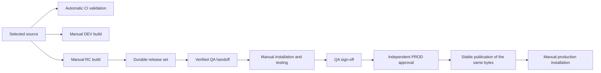

# Release and versioning pipeline: functional requirements

Document date: 2026-09-17  
Scope: the current main-based pipeline, v2 release identities, and manual installation.

## Purpose and authority

The pipeline shall validate application changes, create independently versioned release candidates, and publish stable releases from the exact artifacts approved by QA. It shall preserve enough identity, artifact and approval data to recover interrupted publication without changing the selected release.

This document describes the functional contract of the current repository and provides reviewable acceptance criteria. The complete product requirements remain in [main-prompt.md](../../prompt/main-prompt.md). Workflow inputs and operational details are maintained in [RELEASE-STANDARD.md](RELEASE-STANDARD.md); validation status and outstanding cutover work are maintained in [ROADMAP.md](ROADMAP.md). Requirements expressed as “shall” are obligations, not evidence that live GitHub settings or installations have been verified.

## Scope and participants

The planned [Repository Discovery Engine](DISCOVERY-REQUIREMENTS.md) extends configuration authoring with evidence-backed project discovery, dependency/impact analysis and reviewable `.releasepipeline.yml` generation. Its requirements cover first-file creation and additive scaffolding while preserving existing human-owned release settings. Discovery is not part of the currently implemented release lifecycle; it neither allocates versions nor changes persisted release artifacts or approval evidence.

The framework supports configurable build, test, package and publication commands for single applications and polyglot monorepos. Current configured components are:

| Component | Source | Release outputs |
| --- | --- | --- |
| `web` | `apps/web`; also watches `packages/shared` | React/Vite production ZIP |
| `api` | `apps/api` | .NET publish ZIP and GHCR container image |
| `desktop` | `apps/desktop` | WPF/.NET publish ZIP |

The current provider is GitHub Actions, GitHub Releases and GHCR. Orchestration uses PowerShell on Windows. Reusable adapters and templates support additional application types, including legacy .NET Framework; these are not additional deployed components in this repository.

| Participant | Responsibility |
| --- | --- |
| Developer | Submit reviewed changes and bring hotfixes back to `main`. |
| Release operator | Request DEV or RC builds, select source/version inputs, initiate QA and PROD workflows, and recover failed runs. |
| QA reviewer | Attest to manual installation and testing of every artifact in the selected manifest. |
| PROD reviewer | Independently authorize stable publication of the QA-approved release. |
| Installation operator | Install or roll back artifacts manually and record actual environment state. |
| Repository administrator | Configure runners, permissions, branch/tag protection, environments and reviewers. |

## Lifecycle and workflow interface

DEV artifacts are a separate development output and are not an input to RC or stable promotion. A release set describes included components; it is not an inventory of everything installed in an environment.

| Workflow | Trigger and inputs | Result |
| --- | --- | --- |
| CI | Pull requests; pushes to `main`, `feature/**`, `bugfix/**`, `hotfix/**`, `release/**` | Validation and builds, without deployable release publication |
| DEV Artifacts | Manual dispatch from `main`; `source_ref=main`, `components` empty for all or comma-separated names, `push_image=true` | Development ZIPs/build record and optional API image; Actions downloads retained for 7 days |
| Build Release Candidate | Manual dispatch from `main`; `source_ref=main`, `baseline_release` empty, `version_bump=auto`, `component_overrides={}`, `exact_versions={}`, `release_all=false` | Reserved component RC versions and durable `release/<run-id>` release set |
| Prepare QA | Manual dispatch from `main`; required `release_id` | Verified handoff, then protected QA sign-off |
| Promote PROD | Manual dispatch from `main`; required `release_id` and successful `qa_run_id` | Protected stable publication and production approval record |

## Functional requirements

### Source control and validation

| ID | Requirement |
| --- | --- |
| FR-01 | `main` shall be the only permanent branch. Temporary feature, bugfix, hotfix and genuine stabilization/maintenance release branches shall be supported. Release automation shall not merge, synchronize or move source branches. |
| FR-02 | CI shall validate pipeline tooling/workflow boundaries, lint and build web, and build API and desktop. Configured component tests shall execute during applicable component builds. Validation shall not create semantic release tags or publish deployable releases. |
| FR-03 | Manual release workflows shall execute their orchestration from `main`. Selected application source shall be resolved once to a full commit SHA and kept separate from workflow tooling. RC records shall preserve the orchestrator SHA and release configuration checksum. |
| FR-04 | DEV shall accept only `main` or a full 40-character SHA reachable from `main`. RC shall additionally accept `hotfix/*` or `release/*` sources when an explicit stable component or release-set baseline tag is an ancestor of the selected commit. Invalid or ineligible sources shall fail. |
| FR-05 | DEV shall be created only on manual request, support component selection and optional image publication, and identify outputs by source/run identity. It shall create no semantic release tags and shall not be promotable through QA/PROD. |

### Component selection and version allocation

| ID | Requirement |
| --- | --- |
| FR-06 | Each component shall have an independent semantic version derived from Git tags in its configured namespace, normally `<component>/v<version>`. Branch names shall not determine artifact channels or target environments. |
| FR-07 | Planning shall select each component's highest stable semantic version tag reachable from the selected commit as its baseline. Unreachable releases on newer lines shall not become the baseline for an older maintenance line. |
| FR-08 | Scope shall include components whose source or watched paths changed since their respective baselines, plus configured dependent components. Components without a stable baseline shall be evaluated for bootstrap. `release_all=true` shall include all configured components. An empty RC plan shall fail with an actionable message. |
| FR-09 | Repository-wide watched inputs shall affect all components: `pnpm-lock.yaml`, `pnpm-workspace.yaml`, `package.json`, `.releasepipeline.yml` and `eng/ci`. Changes under `packages/shared` shall also affect web. Unchanged components outside the selected scope shall retain their existing versions/installations. |
| FR-10 | Workflow `auto` shall select a minor bump, except `hotfix/*` sources shall select patch. Explicit workflow major/minor/patch choices, per-component bump overrides and exact base or RC versions shall be supported. An exact version shall determine the selected version; otherwise a component override shall take precedence over the workflow bump, with the configuration default used when no workflow bump is supplied. Overrides shall not by themselves force an unchanged component into scope. |
| FR-11 | Major bumps shall reset minor/patch to zero; minor bumps shall reset patch to zero; patch bumps shall increment patch. Without a stable baseline, automatic calculation shall start from configured `initialVersion`, or `0.0.0` if absent, and apply the selected bump. |
| FR-12 | RCs shall use `<major>.<minor>.<patch>-rc.<sequence>`. Unless an explicit RC version is supplied, the next sequence shall be one greater than the highest allocated RC sequence for that component/base version across repository tags, starting at 1. Sequence numbers shall be independent of workflow run IDs. |
| FR-13 | New versions shall exceed their reachable stable baseline. Unknown component overrides, invalid bumps/versions, reused stable versions and conflicting RC tags shall fail. Global uniqueness shall apply even when releasing an older source line. A source already carrying an RC shall be recovered through its original release run rather than rebuilt by a new request. |

For example, an affected API at stable `2.14.3` normally receives `2.15.0-rc.1`; a hotfix from the `2.14.3` line receives `2.14.4-rc.1`. A subsequent eligible source for the same unreleased base receives `-rc.2`. Stable promotion removes the RC suffix from the published version, while retaining the original build bytes. These examples assume no conflicting versions are allocated.

### RC construction and durable identity

| ID | Requirement |
| --- | --- |
| FR-14 | An RC request shall create a release-set identity `release/<GitHub run ID>`, persist its selected source and plan, and reserve component tags before building. Failed requests may consume RC numbers; recovery shall not delete or reallocate those reservations. |
| FR-15 | Component builds shall use the pinned source and configured build/test/package commands. Outputs shall include SHA-256-identified ZIPs and, where configured, container artifacts with immutable image digests. |
| FR-16 | The release set shall durably retain the plan, staged build bundle, v2 manifest and ZIPs in GitHub Releases, with images in GHCR. The build bundle shall be stored before component publication begins. Release/approval identity shall survive expiry of Actions artifacts. |
| FR-17 | The manifest shall bind the repository, release ID, candidate SHA, source ref, build run, timestamp, component RC versions/tags, archive asset names/checksums and optional image references/digests. It shall also preserve baseline/orchestration/configuration provenance. Promotion shall not rewrite the manifest. |
| FR-18 | Published asset names shall be immutable: a retry may reuse identical bytes but shall reject different bytes under an existing name. Tags shall retain their recorded source commits. Registry publication shall reject an existing version with a different image identity. |
| FR-19 | Incomplete release sets shall remain unavailable for QA handoff. Version allocation and stable publication shall share serialized publication concurrency without cancelling an active publisher. QA testing and approval waits shall remain separate from RC creation. |

### QA preparation and sign-off

| ID | Requirement |
| --- | --- |
| FR-20 | Prepare QA shall consume the explicitly selected persisted release set, irrespective of subsequent changes to `main`. It shall validate repository/release identity, release and component tag commits, every ZIP checksum, and availability of every declared image digest, including releases with ZIP-only components. |
| FR-21 | QA preparation shall provide a manual-installation handoff containing the release/source identity, manifest checksum, download paths/URLs and component checksums/digest references. Its record shall use `artifact-handoff/v2`, `status=prepared` and `installed=false`. |
| FR-22 | After manual installation and testing of every included artifact, a protected QA job shall reverify the prepared manifest checksum and record actual reviewers from GitHub environment review evidence. The requesting actor or a bypassed/rejected gate shall not substitute for approval evidence. |
| FR-23 | QA sign-off shall persist as `qa-signoff-<qa-run-id>.json` using `qa-signoff/v2`, binding release ID, candidate SHA, manifest checksum, run ID, reviewers and evidence URL. Approval shall attest to manual installation/testing; the pipeline shall not claim to have independently observed installation. |

### Stable publication and installation

| ID | Requirement |
| --- | --- |
| FR-24 | PROD shall require a selected release ID, its matching stored QA sign-off, and a successful `prepare-qa.yml` run on `main`. Stored QA reviewers shall match provider evidence. A separate protected PROD approval shall authorize stable publication and record its own reviewer evidence. |
| FR-25 | PROD shall reverify the release and artifacts, then publish stable component tags pointing to the RC source commit. Stable ZIP contents shall be byte-identical to the QA-approved RC ZIPs, even when the asset filename changes to a stable version. Stable container aliases shall resolve to the original image digest. |
| FR-26 | QA and PROD shall not compile, rebuild, repackage or modify embedded application versions. An RC version embedded in a binary may remain visible after stable publication. |
| FR-27 | Each stable release shall retain `source-release-manifest.json` and be bound to one RC manifest checksum. An existing stable release owned by another RC shall be rejected even if its source commit matches. Production evidence shall persist on the release set as `production-approval-<run-id>.json`. |
| FR-28 | Installation and rollback shall remain manual. Workflow handoff/approval jobs shall use environment protection without deployment tracking (`deployment: false`). Operators shall wait for successful publication of the complete selected set before installing it; partial publication shall not count as a deployment. |
| FR-29 | Environment configuration shall be supplied separately from immutable application archives. Web shall support an external `runtime-config.json`, a same-origin `/weatherforecast` fallback for built output, and the local-development API default. .NET shall consume runtime configuration/environment variables. QA and PROD shall use the same application bytes. |

### Recovery, hotfixes and governance

| ID | Requirement |
| --- | --- |
| FR-30 | RC recovery shall rerun the original workflow identity and restore its source, configuration identity and reserved plan. Before durable staging and component publication, the reserved version may be rebuilt. Once the bundle is persisted, recovery shall restore those exact bytes without another application build. Missing staging data after publication began shall require recovery of the original bytes, not reconstruction. |
| FR-31 | QA preparation/sign-off and stable publication shall support retries against the same identity. A new QA run shall have a separate sign-off record; PROD shall reference the successful run. A new RC dispatch shall be treated as a new request, not recovery. |
| FR-32 | Hotfixes shall start from an appropriate production tag/source, use the explicit baseline ancestry rule and normal QA/PROD gates, and return to `main` through a reviewed PR. Branch cleanup shall be a deliberate follow-up; no automatic merge or cherry-pick shall occur. |
| FR-33 | Repository governance shall configure DEV without required reviewers and separate QA/PROD review protections, protect `main` and release tags, and provide publishing permissions only where needed. PR validation shall not receive publishing secrets. |
| FR-34 | Historical releases shall be preserved. Legacy v1/beta records shall not automatically qualify as v2 QA evidence. Migration, live governance changes and historical branch/tag/release deletion shall not happen as incidental code changes. |

## Acceptance scenarios

These scenarios define expected results; they do not imply that every scenario has been exercised against live GitHub services.

| ID | Scenario and expected result | Requirements |
| --- | --- | --- |
| AC-01 | Push or open a PR: pipeline validation and application builds run, with no deployable release or semantic tag publication. | FR-01–03 |
| AC-02 | Request DEV for a reachable main SHA: selected outputs are downloadable. Request a temporary branch or off-main SHA: source validation rejects it. | FR-04–05 |
| AC-03 | Change only API source: include API. Change shared TypeScript: include web. Change a global watched input or request a full release: include all configured components. | FR-06–09 |
| AC-04 | Exercise auto/minor, patch, major, component override, exact version and bootstrap planning: versions follow the documented precedence and arithmetic. Invalid names or allocated tags fail. | FR-10–13 |
| AC-05 | Release an older hotfix while newer stable tags exist off its ancestry: use the older reachable baseline and retain global tag uniqueness. | FR-04, FR-07, FR-12–13, FR-32 |
| AC-06 | Interrupt publication after staging, then rerun the original run: restore the original plan and artifacts, complete publication and perform no additional application build. | FR-14–19, FR-30–31 |
| AC-07 | Alter a ZIP, manifest or tag identity, remove a required artifact, or make a declared image digest unavailable: handoff/promotion fails before accepting that release. | FR-18, FR-20–23 |
| AC-08 | Approve QA after manual testing: persist actual reviewer evidence against the exact prepared checksum. Missing, bypassed or mismatched evidence cannot authorize PROD. | FR-22–24 |
| AC-09 | Promote an approved release: stable tags use the RC source, stable ZIP hashes equal RC hashes, container digests remain equal, and no application build/repackage occurs. | FR-24–29 |
| AC-10 | Retry partial stable publication: reuse matching records/assets; reject another RC's ownership of a stable release. | FR-18, FR-27, FR-31 |
| AC-11 | Expire Actions downloads: QA/PROD can still consume retained release assets and registry digests. Install/roll back manually with external runtime configuration. | FR-16, FR-28–29 |

## Verification status and operational boundaries

The [roadmap](ROADMAP.md) records local validation on 2026-09-16, including Pester, workflow parsing, web lint/build and .NET builds. Existing automated evidence includes [versioning, source selection and workflow boundary tests](../ci/tests/MainRelease.Tests.ps1), [publication recovery integration tests](../ci/tests/ReleaseBuildRecovery.Tests.ps1), [durable store and reviewer evidence tests](../ci/tests/ReleaseStore.Tests.ps1), and the broader [release engine tests](../ci/tests/ReleasePipeline.Tests.ps1).

Real GitHub workflow execution, environment protections, GHCR publication/retagging, hosted runtime configuration and manual installation remain external cutover checks. This document does not mark them complete. Runtime prerequisites and configuration are described in the [root README](../../README.md), [.releasepipeline.yml](../../.releasepipeline.yml) and [migration checklist](MIGRATION.md).

Automatic deployment, fleet-state tracking, WPF installer distribution, automatic branch synchronization and automatic conversion of historical approval evidence are outside the current scope. Rollback uses previously approved artifacts and an operator change record; it does not rebuild an old commit or move a production branch. Follow [RECOVERY.md](RECOVERY.md) for operational recovery.

## Implementation references

| Area | Current implementation |
| --- | --- |
| Workflow entry points | [CI](../../.github/workflows/ci.yml), [DEV](../../.github/workflows/dev-build.yml), [RC](../../.github/workflows/build-release.yml), [QA](../../.github/workflows/prepare-qa.yml), [PROD](../../.github/workflows/promote-prod.yml) |
| Source eligibility and version planning | [ReleasePlanning.ps1](../ci/ReleasePipeline/ReleasePlanning.ps1) |
| RC construction and persistence | [Invoke-ReleaseBuild.ps1](../ci/providers/github/Invoke-ReleaseBuild.ps1), [ReleaseStore.ps1](../ci/providers/github/ReleaseStore.ps1) |
| Manifest validation and handoff | [ArtifactHandoff.ps1](../ci/ReleasePipeline/ArtifactHandoff.ps1) |
| QA and stable publication | [Invoke-ReleaseHandoff.ps1](../ci/providers/github/Invoke-ReleaseHandoff.ps1) |

Keep this document aligned with changes to the product requirements, workflow inputs, versioning rules, artifact identities and approval/recovery behavior.
